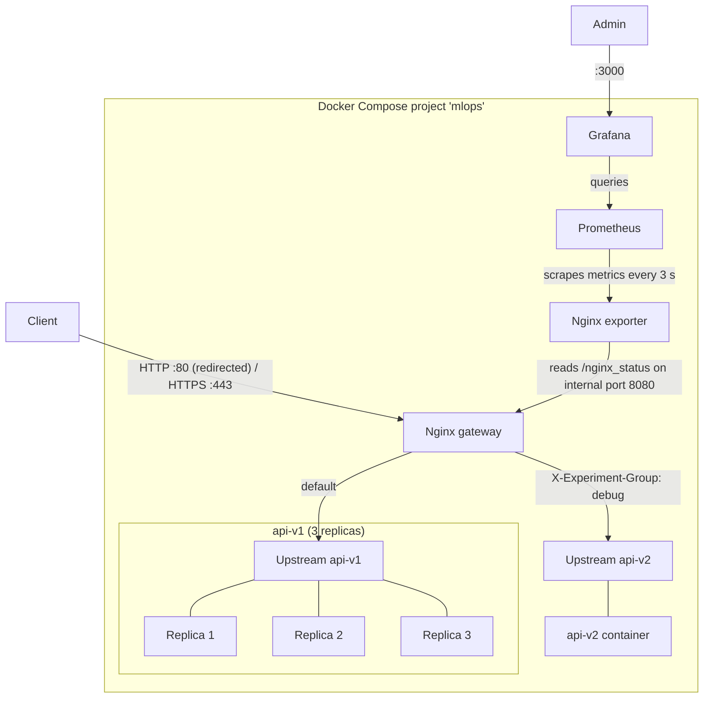

# Sentiment API behind an Nginx Gateway

A machine learning API that predicts the emotion of an English sentence (13 classes, such as *love*, *worry* or *neutral*), served through Nginx as the single, secured entry point. The stack runs in Docker Compose and is started, stopped and tested with `make`.

The project solves the DataScientest exam "Advanced Deployment with Nginx"; the original task is in [docs/exam-brief.md](docs/exam-brief.md).

## Features

| # | Objective | How this project meets it |
|---|---|---|
| 1 | Reverse proxy | Nginx is the only service reachable from the host for the API; the API containers have no published ports. |
| 2 | Load balancing | `api-v1` runs 3 instances; Nginx distributes the requests over the 3 replicas (Round Robin). |
| 3 | HTTPS | Nginx terminates TLS with a self-signed certificate for `localhost`; plain HTTP is redirected to HTTPS (HTTP 301). |
| 4 | Access control | `/predict` requires HTTP basic authentication. |
| 5 | Rate limiting | `/predict` accepts 10 requests per second per client IP, with a burst of 5; requests beyond that are rejected (HTTP 429). |
| 6 | A/B testing | Requests carrying the header `X-Experiment-Group: debug` go to `api-v2`, which also returns the probability of every class; any other request goes to `api-v1`. |
| 7 | Monitoring | An Nginx exporter turns Nginx's status page into metrics. Prometheus collects them. Grafana reads from Prometheus and shows the metrics on a dashboard (Nginx). |

## Architecture



Clients reach the stack only through Nginx, over HTTP on port 80 (redirected) or HTTPS on port 443. Nginx forwards each prediction request to one of two upstreams, named groups of API containers: `api-v1` with three replicas for regular traffic, and `api-v2` with a single container for requests in the debug group. Alongside the request path, the Nginx exporter reads Nginx's status page, Prometheus collects the exporter's metrics every 3 seconds, and Grafana queries Prometheus; an administrator opens Grafana on port 3000.

### How Nginx handles a request

1. **Port 80:** every request is redirected to the same URL on HTTPS.
2. **Port 443:** Nginx completes the TLS handshake with the certificate from `deployments/nginx/certs/`.
3. **`/predict`:**
   1. Basic authentication against `.htpasswd`; a wrong or missing password gets 401.
   2. Rate limit per client IP; a request over the limit gets 429.
   3. The value of the header `X-Experiment-Group` selects the upstream: `debug` → `api-v2`, anything else or no header → `api-v1`.
   4. Nginx forwards the request and adds the response header `X-Upstream-Addr`, the address of the container that answered. The tests use it to see the load distribution.
4. **Port 8080, internal:** serves only `/nginx_status`, a plain-text page with Nginx's live statistics: open connections, connections accepted and handled since start, total requests, and how many connections are currently reading, writing or waiting. The Nginx exporter reads this page and turns the numbers into metrics for Prometheus. Port 8080 is not published to the host, so only containers on the Compose network can reach the page; in addition, Nginx accepts only callers from the network's address range `10.123.0.0/24` and from inside its own container (`127.0.0.1`). The public HTTPS server does not serve the page.

### Startup order

Compose starts the API containers first. Each one has a healthcheck that is satisfied once the API answers, which happens only after the model has loaded. Nginx starts when all four API containers are healthy, so the first request never meets an API that is still starting. Prometheus and Grafana have healthchecks as well, and `make start-project` returns only when every healthcheck passes.

## Services and Ports

All published ports are bound to `127.0.0.1`, so the stack is reachable only from the machine it runs on.

| Service | Built from | Host port | Purpose |
|---|---|---|---|
| `nginx` | `deployments/nginx/Dockerfile` | 80, 443 | Gateway: redirect, TLS, authentication, rate limit, routing; status page for the exporter on internal port 8080 |
| `api-v1` (×3) | `src/api/v1/Dockerfile` | none | Standard API |
| `api-v2` | `src/api/v2/Dockerfile` | none | Debug API, adds class probabilities to the response |
| `nginx_exporter` | `nginx/nginx-prometheus-exporter:1.5.0` | none | Converts Nginx's status page into Prometheus metrics |
| `prometheus` | `prom/prometheus:v3.15.0` | 9090 | Collects and stores the metrics |
| `grafana` | `grafana/grafana:13.2.3` | 3000 | Nginx dashboard on top of Prometheus |

The Nginx image is built by this project and contains its configuration, certificate and password file.

Prometheus and Grafana run the unchanged public images. This project adds its own configuration files, which Compose places into the containers read-only:

- `deployments/prometheus/prometheus.yml` tells Prometheus to collect the exporter's metrics.
- The three files in `deployments/grafana/` give Grafana its Prometheus data source and the *Nginx* dashboard. Grafana loads them at every start, so the dashboard is there without setting anything up by hand.

Both keep their collected data in the volumes `prometheus_data` and `grafana_data`.

## Quick Start

Prerequisites: Docker Engine with the Compose plugin, `make`, `curl` and `bash`. Ports 80, 443, 3000 and 9090 must be free on `127.0.0.1`.

```bash
make start-project   # build the images, start the stack, wait until it is healthy
make test            # restart the stack and run the test script
make stop-project    # stop and remove the containers (volumes are kept)
make rerun-project   # stop, then start again from scratch
make test-api        # send one prediction request
```

`make test` restarts the stack before testing, so it also works on its own, without a prior `make start-project`.

## Using the API

Standard prediction, answered by one of the `api-v1` replicas:

```bash
curl -X POST "https://localhost/predict" \
     -H "Content-Type: application/json" \
     -d '{"sentence": "I love this sunny day"}' \
     --user admin:admin \
     --cacert ./deployments/nginx/certs/nginx.crt
```

```json
{"prediction value": "love"}
```

The same request with the header `-H "X-Experiment-Group: debug"` is answered by `api-v2` and adds `prediction_proba_dict`, the probability of each of the 13 classes.

`--cacert` tells `curl` to trust the self-signed certificate. A browser shows a warning for it instead.

Monitoring:

- Prometheus: <http://localhost:9090>, target `nginx_exporter:9113` under *Status → Targets*
- Grafana: <http://localhost:3000>, login `admin` / `admin`. The dashboard *Nginx* (<http://localhost:3000/d/nginx>) refreshes every 5 seconds and shows whether Nginx is up, requests per second, active connections, connections by state (reading, writing, waiting), and accepted versus handled connections per second, where handled below accepted means dropped connections.

## Tests

`tests/run_tests.sh` sends real requests through Nginx and exits with a non-zero code if any test fails. `make test` runs it.

| Test | Expects | Objective |
|---|---|---|
| 1 | Prediction with valid credentials returns 200 | 1, 3, 4 |
| 2 | Request with `X-Experiment-Group: debug` returns `prediction_proba_dict` | 6 |
| 3 | Wrong password returns 401 | 4 |
| 4a | After a burst of 15 parallel requests, the service still answers (no 502) | 5 |
| 4b | At least one request of the burst was rejected with 429 | 5 |
| 5 | Prometheus answers on port 9090 | 7 |
| 6 | Grafana answers on port 3000 | 7 |
| 7 | `http://localhost/predict` returns 301 to `https://localhost/predict` | 3 |
| 8 | Six consecutive requests are answered by three different `api-v1` containers | 2 |

Tests 1 to 6 are the ones provided with the exam. They confirm that the API answers, that routing and authentication work, and that the monitoring services are up, but three objectives remain unverified by them:

- **Rate limiting:** test 4a only confirms that the service survives a burst, which it also does with no limit at all.
- **HTTP redirect:** every provided test calls HTTPS directly, so port 80 is never reached.
- **Load balancing:** a single `api-v1` container answers every provided test just as well as three.

Tests 4b, 7 and 8 close these gaps, so that a passing `make test` confirms all six required objectives, not only the parts the provided tests reach. Each of them fails if its feature is removed.

## Configuration

| What | Where | Value |
|---|---|---|
| Users for `/predict` | `deployments/nginx/.htpasswd` | `admin` / `admin` |
| Rate limit | `deployments/nginx/nginx.conf` | 10 requests/s per IP, burst 5, status 429 |
| A/B routing | `deployments/nginx/nginx.conf` | `map` on the header `X-Experiment-Group` |
| Number of `api-v1` replicas | `docker-compose.yml` | 3 |
| Compose network | `docker-compose.yml` | `10.123.0.0/24`, the range allowed to read `/nginx_status` |
| Scrape target and interval | `deployments/prometheus/prometheus.yml` | `nginx_exporter:9113`, every 3 s |
| Grafana admin login | `docker-compose.yml` | `admin` / `admin` |
| Grafana data source | `deployments/grafana/datasource.yml` | Prometheus at `http://prometheus:9090`, default |
| Grafana dashboard | `deployments/grafana/nginx-dashboard.json`, loaded through `deployments/grafana/dashboards.yml` | dashboard *Nginx* |

Changes to the Nginx configuration, the certificate or the password file take effect after the image is rebuilt, which `make start-project` does.

### Certificate

The certificate is self-signed, valid for `localhost` for one year. To create a new one:

```bash
openssl req -x509 -nodes -newkey rsa:2048 -days 365 \
  -keyout deployments/nginx/certs/nginx.key \
  -out deployments/nginx/certs/nginx.crt \
  -subj "/CN=localhost" \
  -addext "subjectAltName=DNS:localhost"
```

### Password file

To add a user or change a password (`htpasswd` comes with the Apache utilities):

```bash
htpasswd deployments/nginx/.htpasswd <user>
```

### API dependencies

Both API versions share one [uv](https://docs.astral.sh/uv/) project in `src/api/`. The images install the exact versions from `uv.lock`. scikit-learn is pinned to 1.6.1, the version the model was saved with. `requirements.txt` is generated from the lock file:

```bash
cd src/api
uv add <package>
uv export --no-hashes --no-dev --format requirements-txt -o requirements.txt
```

## Project Structure

```text
.
├── .dockerignore                 # files kept out of the API image builds
├── .gitignore
├── Makefile                      # start-project, stop-project, rerun-project, test, test-api
├── README.md
├── docker-compose.yml            # all services, healthchecks, network, volumes
├── deployments
│   ├── grafana
│   │   ├── datasource.yml        # Prometheus as Grafana's data source
│   │   ├── dashboards.yml        # where Grafana loads dashboards from
│   │   └── nginx-dashboard.json  # the Nginx dashboard
│   ├── nginx
│   │   ├── Dockerfile            # Nginx image with configuration, certificate and users
│   │   ├── nginx.conf
│   │   ├── .htpasswd
│   │   └── certs
│   │       ├── nginx.crt
│   │       └── nginx.key
│   └── prometheus
│       └── prometheus.yml
├── docs
│   └── exam-brief.md             # the original exam task
├── model
│   └── model.joblib              # trained scikit-learn pipeline
├── src
│   └── api
│       ├── pyproject.toml        # uv project shared by v1 and v2
│       ├── uv.lock
│       ├── requirements.txt      # exported from uv.lock
│       ├── v1
│       │   ├── Dockerfile
│       │   └── main.py           # standard API
│       └── v2
│           ├── Dockerfile
│           └── main.py           # debug API
└── tests
    └── run_tests.sh
```
